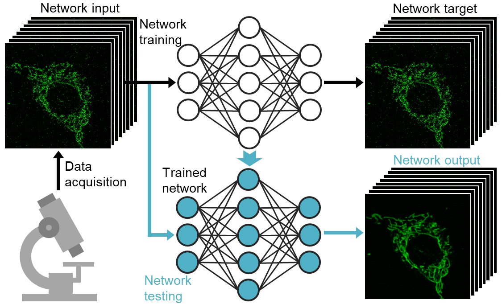
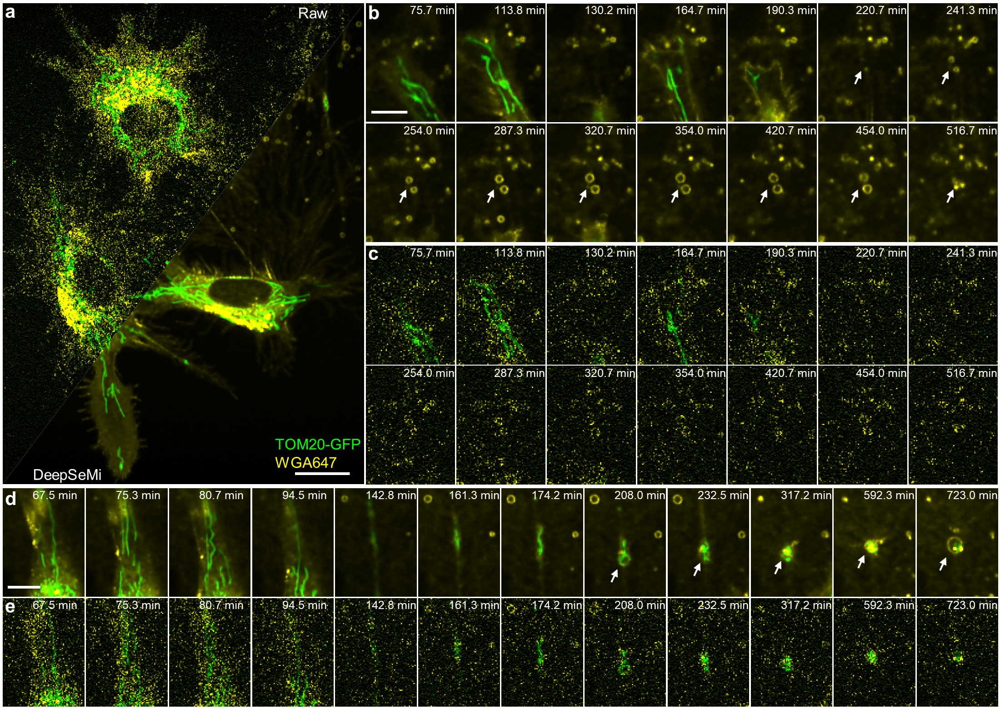

# Deep learning based self-supervised enhanced microscopy(2023.06)

Implementation for deep learning based self-supervised enhanced microscopy (DeepSeMi)

    

## 📋 Table of content
    1. [Overview](#Overview)
 2. [Quick start DeepSeMi](#Start)
    1. [Environment](#Environment)
    2. [Install dependencies](#Dependencies)
    3. [Download the demo code and data](#Download)
    4. [Run the trained model](#Run)
    5. [Work for your own data](#Owndata)
   3. [Other information](#Information)
        1. [Results](#Results)
        2. [Citation](#Citation)
        2. [Email](#Email)

## **📚** Overview <a name="Overview"></a>
Fluorescence microscopy provides optical access to comprehensive longitudinal live cells multi-spectral imaging, which assists biological scientists discover numerous new biological phenomenas. We developed a deep learning based self-supervised enhanced microscopy (DeepSeMi) established on a novel 3D full blind spot convolution, which is able to recover low SNR recordings without high SNR recordings.  For more details and results, please see our companion paper titled 



## **⏳** Quick start DeepSeMi <a name="Start"></a>
This tutorial will show how DeepSeMi enhances the  microscopic captures.
### **💡** Environment <a name="Environment"></a>
* Ubuntu 16.04 
* Python 3.6
* Pytorch 
* NVIDIA GPU (24 GB Memory) + CUDA

### **💡** Install dependencies <a name="Dependencies"></a>
* Create a virtual environment and install some dependencies. The version of pytorch, the version of torchvision and the version of cuda need to [match](https://pytorch.org/get-started/previous-versions/).
```
$ conda create -n deepsemi_env python=3.6
$ conda activate deepsemi_env
$ pip install --upgrade pip
$ pip install -q torch
$ pip install -q torchvision
$ pip install scipy==1.5.4 tifffile scikit-image==0.17.2 h5py==3.1.0 opencv-python==4.6.0.66
```
### **💡** Download the demo code and data <a name="Download"></a>
We upload a demo data on Google drive: [low light intensity mitochondria imaging by the confocal microscopy](https://drive.google.com/drive/folders/1WiTrL5gRuMUssMYt2uDRDO-5pmmrdNSc?usp=sharing). To run the demo script, those data need to be downloaded and put into the *DeepSeMi/datasets* folder. We upload a trained denoising model and you can download it into *DeepSeMi/pth* folder. 


### **💡** Run the trained model <a name="Run"></a>
Run the script.py to enhance the demo data. The necessary prompt information is written in the *script.py*.
```
$ python script.py
```
The output from the demo script can be found in the *DeepSeMi/results* folder. 
### **💡** Work for your own data <a name="Owndata"></a>
Run the script.py to retrain the network based on your own data. You need to put your data in *DeepSeMi/datasets* folder. Then follow the tutorial information in the *script.py* to run the code. The intermediate results of code running will be saved under *DeepSeMi/results*. You can utilize them to monitor the training process.

```
$ python script.py
```

## 🤝 Other information <a name="Information"></a>
### **📝** Results

Some of our results are exhibited below. For more results and further analyses, please refer to the companion paper where this method first occurred.

**Confocal imaging of cell migration**



### **📝** Citation <a name="Citation"></a>

If you use this code and relevant data, please cite the corresponding paper where original methods appeared: https://www.biorxiv.org/content/10.1101/2022.11.02.514874v1


### **📝** Email <a name="Email"></a>
We are pleased to address any questions regarding the above tools through emails (zhanggx19@mails.tsinghua.edu.cn ).
